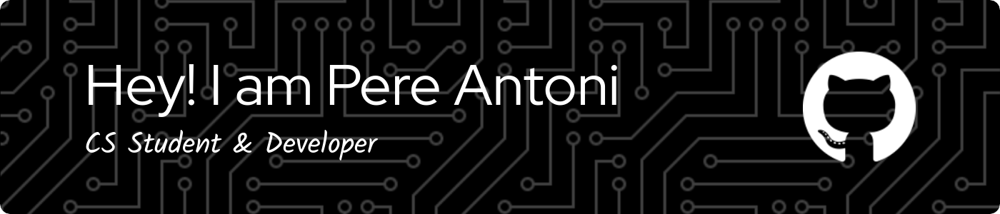

# Hi there, I'm Pere Antoni

I'm a Computer Science student in the Universitat de les Illes Balears. For now I have a brief experience in the development world but I'm very excited about learning more about these awesome world. Nevertheless, I've done some projects for my degree and I recently get involved in hackathons competing in HackUPC 2024.
## Languages & Tecnologies

 
 

 
 

 
 

## 🔗 Links

